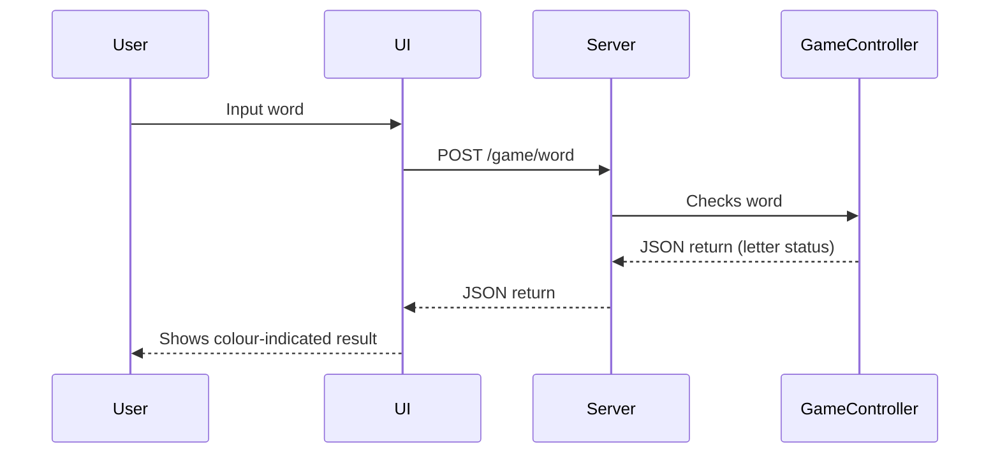

# GuessAgainBro

**GuessAgainBro** – tai žodžių spėjimo žaidimas, realizuotas naudojant C++ kalbą. Projektas imituoja originalų **Wordle** žaidimą, leidžiant vartotojams per naršyklę spėti 5 raidžių žodžius, kol jie atspėja teisingą per ribotą bandymų skaičių.

## Struktūra
### Komponentai
| Komponentas | Atsakomybė|
|--|--|
| Frontend UI | Vartotojo sąsaja, formų pateikimas, žodžio įvedimas, rezultatų vizualizacija |
| Controlleriai | Registruoja maršrutus (`GET /`, `POST /game/word`), apdoroja JSON |
| Žaidimo logika | Tikrina raidžių atitikimą, kuria atsakymą, įvertina spėjimą |
| Duombazė | Saugo šiandienos žodį, gali tikrinti ar žodis legalus |

### Duomenų tekmė

### Įvedimas / išvedimas
-   **Įvedimas**: vartotojas suveda žodį (per formą ar mygtukus)
    
-   **Išvedimas**: žodis parodomas su spalvotais indikatoriais (žalia, geltona, pilka)
    
-   Atsakymai į POST siunčiami JSON formatu, pvz.:
```json
{
  "1": 1,
  "2": 2,
  "3": 0,
  "4": 1,
  "5": 0
}
```
Kur `1` reiškia teisingą vietą, `2` – klaidingą vietą, `0` – raidė neegzistuoja.

### Saugojimas
- **Žodžių duomenų bazė**  
    Atsakinga už visų galimų žodžių saugojimą bei validavimą. Žodžiai įkeliami iš failo.
    
-   **Dienos žodis (TodaysWord)**  
    Sistemoje yra pasirinktas vienas žodis, kuris laikomas atmintyje ir naudojamas viso žaidimo metu. 

### Technologijos ir infrastruktūra
| Komponentas | Technologija |
|--|--|
| Serveris | C++ su [`cpp-httplib`](https://github.com/yhirose/cpp-httplib) |
| JSON | [`nlohmann/json`](https://github.com/nlohmann/json) |
| UI | React.js |
| Komunikacija | HTTP POST JSON |

## Funkcijos


Pagrindinės vartotojo funkcijos:
- Pradėti žaidimą
- Įvesti spėjimą
- Peržiūrėti rezultatą


Pradėjus žaidimą, vartotojas įveda 5 raidžių žodį. Šis žodis yra perduodamas serveriui ir tikrinama - ar tai validus žodis, ar tai "šiandienos žodis" ir ar tai buvo šeštas įvedimo bandymas. 
Jeigu žodis yra "šiandienos žodis", vartotojas laimėjo. 
Jeigu žodis yra netinkamas, arba tai nėra "šiandienos žodis", vartotojas gauna atsakymą, kur kiekvieną raidė yra nuspalvinta žaliai, geltonai arba pilkai.
Jeigu vartotojas nesugebėjo atspėti žodžio po šešių bandymų, žaidimas yra pralaimėtas.

## Paleidimas
Norint paleisti projektą, pirmiausia atidarykite komandų eilutę ir pagrindiniame kataloge paleiskite komandą `make`, kad būtų sukompiliuotas serveris. Tada paleiskite sukompiliuotą failą (`app.exe`).
Tuomet eikite į katalogą `front/word-guesser-app` ir paleiskite frontendą su komanda `npm start`.
GuessAgainBro.md
